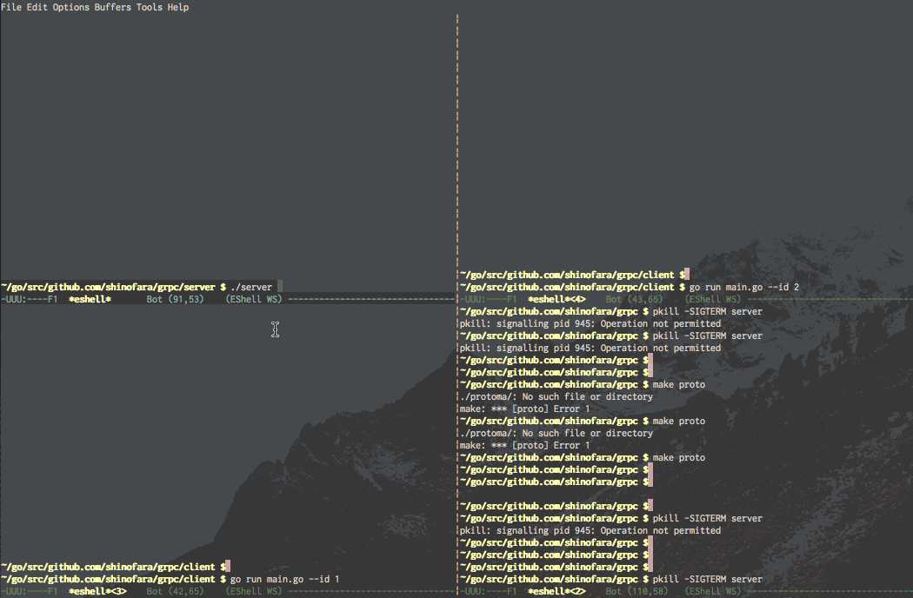

# golang-grpc-example

## 1. Example 1

Mac上で、gRPC ServerとgRPC Client x 2を実行して、SIGTERM

gRPC Server

```
$ cd server
$ ./server
```

gRPC Client

```
$ cd client
$ go run main.go --id 1
$ go run main.go --id 2
```

Kill -SIGTERM

```
$ pkill -SIGTERM server
```



## 2. ServerだけDocker上に移動

### 手順

Server起動

```
$ cd server
$ docker build -t a .
$ docker run -p 19003:19003 --rm a
```

Client1

```
$ cd client
$ go run main.go
```

GracefulStop

```
pkill -fl -SIGTERM bin/docker
```

Client2

Graceful中に新しいリクエストを受け付けない事を確認

```
$ cd client
$ go run main.go --id 1
```


## 3. docker-composeを使った確認

結果killの仕方で思った結果とちがう結果が帰ってきた

```
$ docker-compose up serer
```

```
$ ps | grep docker-compose
kill -SIGTERM xxxxx
```

の場合は、docker-compose自体の停止となってしまい、コンテナ内部までSIGNALの通知が行っていない。
その為、docker-composeは自信で定めた時間は、内部プロセスが存在しても待つが、それをすぎると強制KILLを行っている

https://docs.docker.com/compose/compose-file/#stop_grace_period
Default：10秒

その為、docker-composeをKILLする際に、ちゃんとコンテナ内部の処理が終わる事までまとうと思ったら、
`stop_grace_period: 30s` を設定すればよい


docker-composeを使ってコンテナに対して正しく、SIGTERMを送るには

```
$ docker-compose kill -s SIGTERM server
```

が正しい、この場合 [test-2](https://github.com/shinofara/golang-grpc-example#2-server%E3%81%A0%E3%81%91docker%E4%B8%8A%E3%81%AB%E7%A7%BB%E5%8B%95) のときと同じ挙動を確認できた


## 4. docker-composeに正しい設定をして再度動作確認

今回は、`stop_grace_period: 30s` を設定して確認
また、killを実行すると、docker-composeのgracefulが走ってしまい、コンテナ内部のログがでないので、ServerがClientに返すメッセージの中に、その時点のServerの状態を含めるようにして確認した

手順は１つ前と同じなので割愛


 

 docker-composeのような、コンテナマネジメントツール側のGraceful Stopが実行に入ると、コンテナ内部まで伝達されている事が確認とれた。
 思うことは内部＋数十秒レベルは余裕を持っておくと先に、マネジメントツールが死ぬという状態は無くて良さそう

## 5. おまけkubernetes

k8s上にserverを立ち上げて、実行してみた。
問題無さそう

